<div align="center">

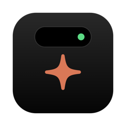

# VibeNotch

**El notch de tu Mac, convertido en centro de control para tus agentes de IA, tus archivos y tu día.**

Claude Code · app de Claude · Codex · Cursor · estante tipo Dropover · buscador de archivos · portapapeles y notas · convertidor y compresor de archivos · widgets

Creado por **[Uriel Nakach](https://github.com/uriel123-coder)**

[](https://github.com/uriel123-coder/vibenotch/actions/workflows/build.yml)
[](https://github.com/uriel123-coder/vibenotch/releases/latest)


[](LICENSE)

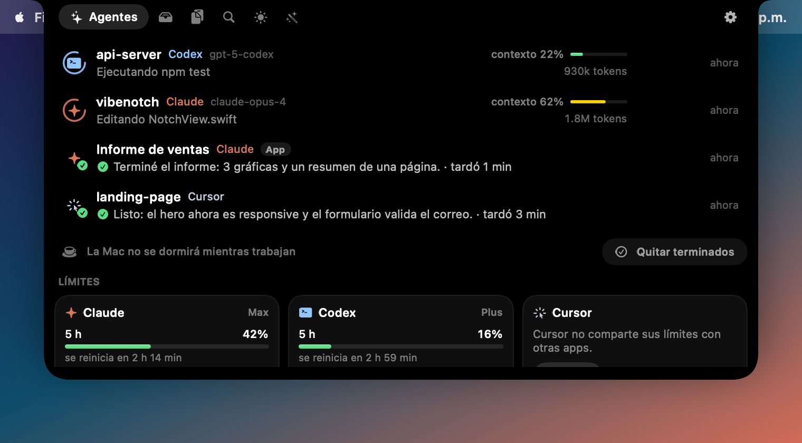

</div>

**Instalar o actualizar** (pega esto en Terminal):

```bash
curl -fsSL https://raw.githubusercontent.com/uriel123-coder/vibenotch/main/scripts/install.sh | bash
```

Si ya la tienes, el mismo comando la actualiza sin perder tus ajustes ni tus notas. Más detalles en [Instalación](#instalación-1-minuto) y [Actualizar](#actualizar).

---

## Índice

- [¿Qué hace?](#qué-hace)
- [Instalación (1 minuto)](#instalación-1-minuto)
- [Actualizar](#actualizar)
- [Primeros pasos](#primeros-pasos)
- [Conectar tus agentes](#conectar-tus-agentes)
- [Avisos en el celular](#avisos-en-el-celular)
- [Con notch o sin notch, una o varias pantallas](#con-notch-o-sin-notch-una-o-varias-pantallas)
- [Personalizar](#personalizar)
- [Consumo: RAM y batería](#consumo-ram-y-batería)
- [Atajos de teclado](#atajos-de-teclado)
- [Permisos](#permisos)
- [Privacidad](#privacidad)
- [Solución de problemas](#solución-de-problemas)
- [Desinstalar](#desinstalar)
- [Compilar desde el código](#compilar-desde-el-código)
- [Créditos](#créditos)
- [English](#english)

---

## ¿Qué hace?

VibeNotch vive en el notch (o en una "isla" flotante si tu Mac no tiene notch). Pasa el mouse arriba al centro y se abre. Tiene 6 pestañas:

### ✨ Agentes: ve lo que hace tu IA sin cambiar de ventana

- **Claude Code, app de Claude, Codex y Cursor** en un solo lugar: qué proyecto, qué está haciendo ("Editando NotchView.swift", "Ejecutando npm test") y si ya terminó.
- **Responde preguntas desde el notch**: cuando Claude Code te hace preguntas de opción múltiple (o varias a la vez), aparecen ahí mismo. Tocas la opción, escribes "Otra respuesta" o eliges responder en la terminal.
- **Aprueba planes**: cuando Claude termina de planear, lees el plan y eliges **Aprobar** o **Seguir planeando**.
- **Permisos desde el notch**: cuando Claude Code pide permiso para correr un comando, respondes **Permitir** o **Rechazar** sin ir a la terminal.
- **Terminó, y qué hizo**: al acabar ves una palomita, el resumen de lo que respondió y cuánto tardó ("Listo: el formulario ya valida el correo · tardó 3 min"), con su sonido.
- **App de Claude (escritorio)**: sigue tus sesiones de Claude Code y Cowork dentro de la app. Ves cuándo trabaja, cuándo termina y cuándo te necesita, además de tus límites de uso, sin configurar nada.
- **Contexto y tokens** de cada sesión (barra de contexto usado y tokens totales).
- **Límites de tu plan**: ventana de 5 horas y semanal de Claude (Pro/Max) y de Codex (Plus/Pro), con cuándo se reinician.
- **Cada quien con su nombre**: lo que haces en Cursor sale como **Cursor**, aunque Cursor use por dentro los hooks de Claude Code. Si el agente de Cursor te hace una pregunta, el notch te la muestra al momento ("Cursor te pregunta", con las opciones y el botón **Ir a Cursor**), aunque Cursor esté en pantalla completa; el aviso se quita solo cuando respondes en Cursor. Cursor no avisa de sus preguntas por hooks, así que VibeNotch lee, solo en modo lectura, las últimas líneas de la base de datos local de Cursor.
- **Avisos en tu celular**: cuando un agente termina o te pregunta algo, te llega una notificación al iPhone o Android, aunque estés lejos. Ve [Avisos en el celular](#avisos-en-el-celular).
- **La Mac no se duerme mientras trabajan**: si Claude, Codex o Cursor están trabajando, tu Mac se queda despierta aunque te alejes; cuando todos terminan, vuelve a dormirse como siempre. Opcionalmente también mantiene la pantalla encendida (Ajustes → Agentes → Mac despierta). Si cierras la tapa sin monitor externo, macOS la duerme de todos modos.
- **Se limpia sola**: lo que ya terminó desaparece de la lista a los 10 minutos (lo cambias en Ajustes → Agentes: 2 min, 30 min, 1 hora o nunca). También puedes tocar **Quitar terminados** o la ✕ de cada sesión.

<p align="center">
  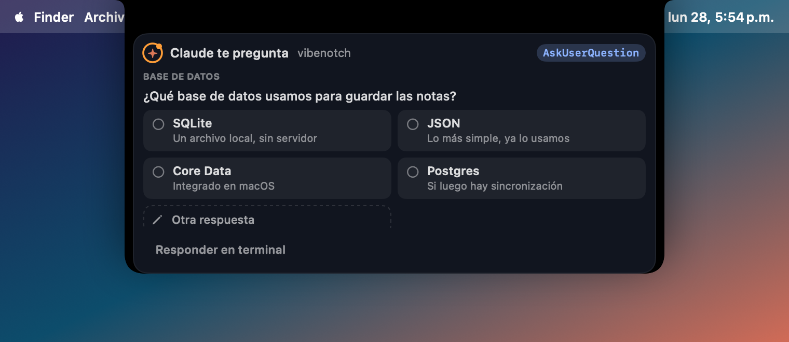
  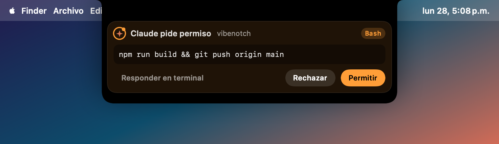
</p>

### 📥 Estante: arrastra y suelta, como Dropover

Arrastra cualquier archivo hacia el notch y se queda ahí guardado. Después lo arrastras a donde quieras (Mail, Slack, Finder, un prompt…). Desde el estante también puedes **reducir su peso**, juntarlo en un .zip, mandarlo por AirDrop, copiar rutas o abrirlo en Convertir.

**Sin notch no tienes que atinarle a nada:** en cuanto empiezas a arrastrar un archivo, aparece arriba al centro una zona verde que dice **"Suéltalo aquí"**.

### 🔍 Buscar: encuentra cualquier archivo por su nombre

Presiona **⌃⌥F** (o toca la lupa) y escribe parte del nombre: "factura", "contrato mayo", "logo". Los resultados salen mientras escribes.

- **Sin escribir nada** ves tus archivos más recientes (modificados o descargados hace poco).
- **Filtra** por Documentos, PDF, Imágenes, Videos o Carpetas.
- **Úsalo al momento**: ↩ lo abre, ⌘↩ lo muestra en Finder, o **arrástralo** directo a Mail, Slack, un prompt o el estante.
- **Rápido de verdad**: VibeNotch hace su propio índice de tus carpetas (Escritorio, Descargas, Documentos, iCloud Drive y las demás carpetas de tu usuario) en un par de segundos y en segundo plano. Después cada búsqueda tarda milisegundos, aunque Spotlight esté apagado. Se salta cosas que nadie busca a mano, como `node_modules`, carpetas `build` o miles de archivos de datos.

<p align="center">
  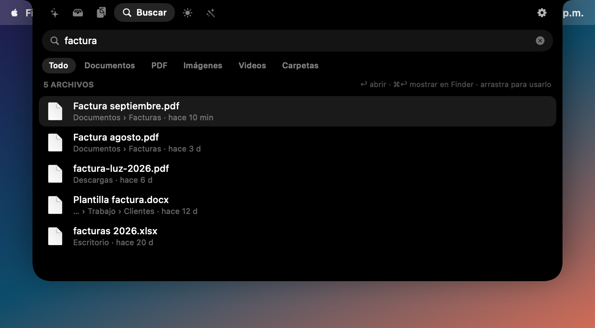
  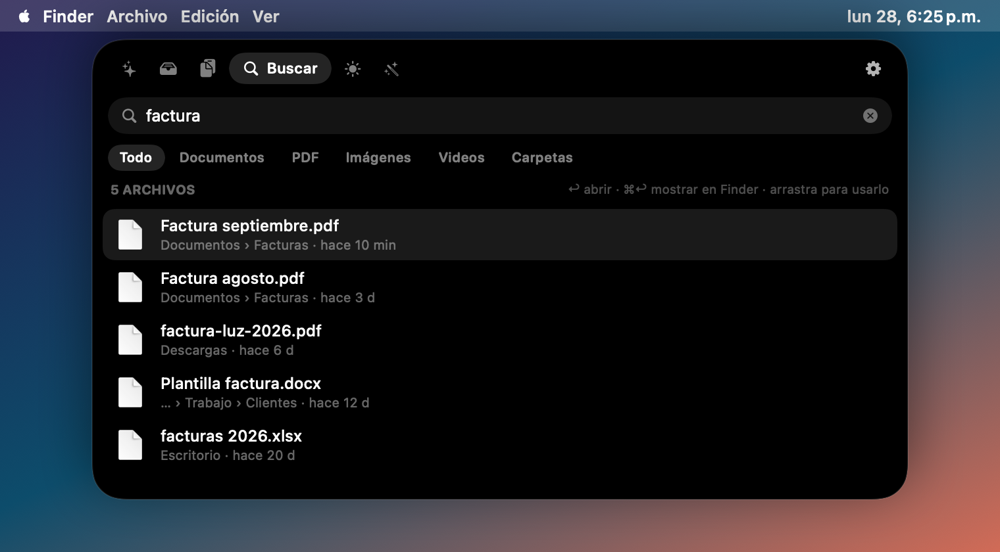
</p>

### 📋 Clips: historial, guardados y notas

- **Historial** de lo último que copiaste (texto, links, colores, imágenes y archivos), con buscador.
- **Guardados**: textos que pegas seguido, con atajo **⌃⌥1…9**.
- **Notas**: tarjetas de colores que se quedan ahí (tu correo, la clave del Wi-Fi, una dirección, un prompt). Un clic y quedan copiadas; también puedes arrastrarlas a cualquier app. Fija las que más usas para verlas en **Hoy**.
- **Traducir y corregir con un clic**: pasa el mouse sobre un texto y toca 💬 para traducirlo (español ⇄ inglés, o al idioma que elijas) o ᵃᵇᶜ para corregir la ortografía ("nesesito la presentasion" → "necesito la presentación"). El resultado queda copiado, listo para pegar. También con **⌃⌥T** traduces lo que acabas de copiar. Usa el traductor y el corrector de macOS: no sale nada a internet (traducir necesita macOS 15 o más nuevo).
- Ignora automáticamente contraseñas de 1Password y apps que marcan el contenido como privado.
- Opcional: pegar directamente al elegir un clip o una nota.

<p align="center">
  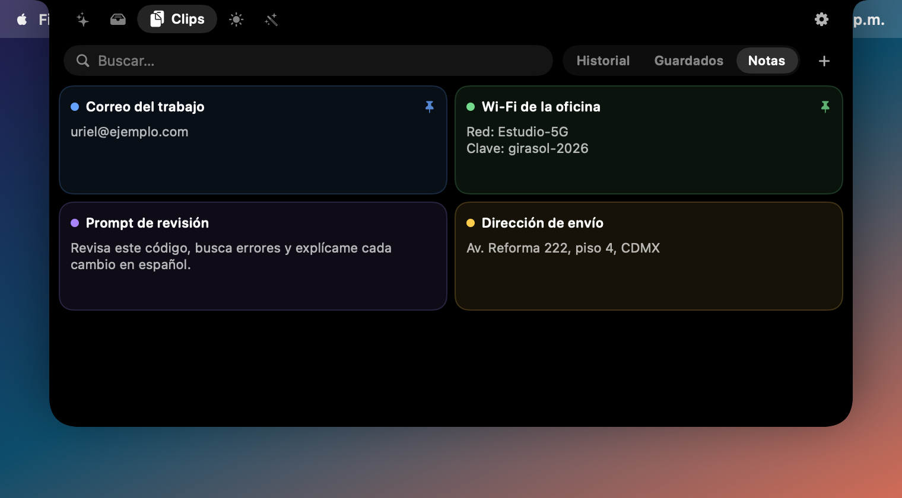
  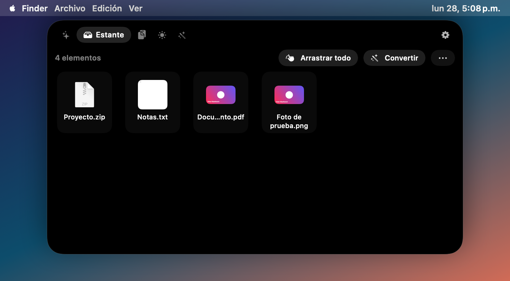
</p>

### ☀️ Hoy: widgets que tú eliges

Activa, quita y ordena los que quieras en **Ajustes → Hoy**:

- **Música**: Spotify o Apple Music con controles.
- **Temporizador** y Pomodoro.
- **Notas fijadas**: un clic y las copias.
- **Batería** con tiempo restante (avisa al conectar el cargador y cuando queda poca).
- **Próximos eventos** de tu calendario, con aviso 5 minutos antes. Si la reunión tiene enlace de Zoom, Google Meet, Teams, Webex o FaceTime, aparece el botón **Unirse** (en el widget y en el aviso).
- **Sistema**: CPU, RAM y disco libre, y cuánta memoria usa VibeNotch.

<p align="center">
  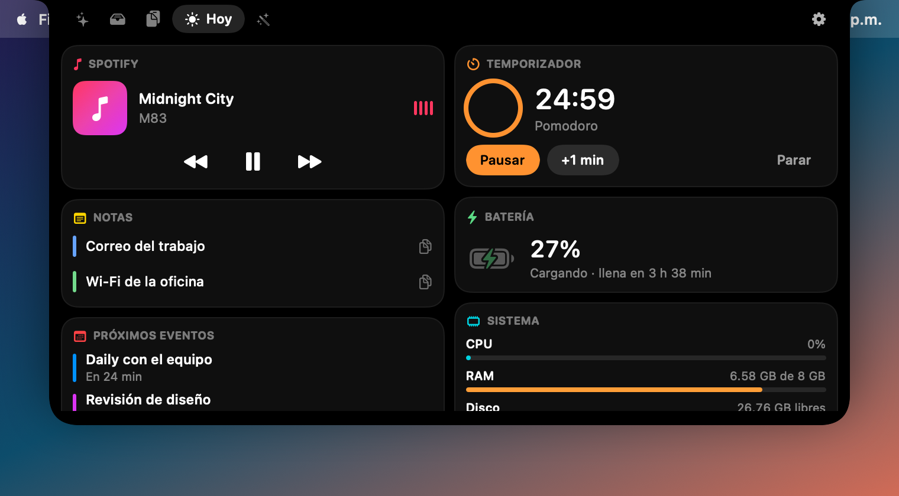
  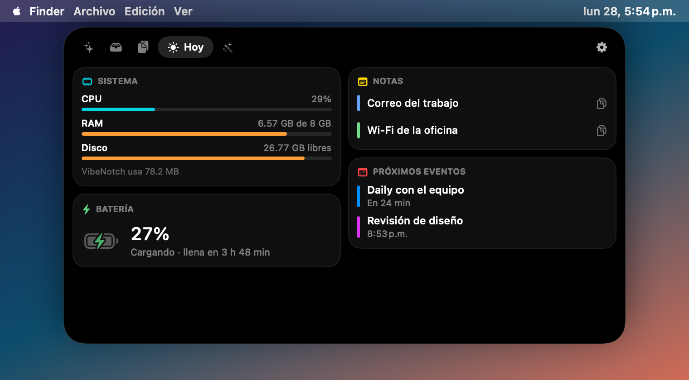
</p>

### 🪄 Convertir: 23 herramientas para archivos

Suelta archivos y elige qué hacer. Todo se hace en tu Mac, sin subir nada a internet.

| Tipo | Herramientas |
| --- | --- |
| Imagen | A JPG · A PNG · A HEIC · Comprimir · Reducir 50% · **Quitar fondo** · Girar · **Copiar texto (OCR)** · Quitar datos GPS/EXIF |
| PDF | Unir PDFs e imágenes en un PDF · Comprimir PDF · PDF a imágenes · Copiar texto |
| Video y audio | Comprimir video · A MP4 · **A GIF** · Sacar audio · A M4A |
| Archivos | **Reducir peso** (cualquier archivo) · Hacer .zip · Descomprimir · Copiar rutas · AirDrop |

**La compresión es de verdad.** Prueba varias versiones (calidad, tamaño, formato) y se queda con la mejor que pese al menos 15 % menos. Si tu archivo ya estaba optimizado, te lo dice ("Ya estaba optimizado") en vez de darte una copia igual o más pesada. Ejemplos reales: una foto PNG de 1.4 MB queda en 66 KB, y un fondo de pantalla HEIC de 26 MB en 1.5 MB. Los PDF escaneados se aligeran sin tocar los PDF con texto, y los GIF no se tocan para no perder la animación.

Te dice cuánto ahorraste ("1.4 MB → 66 KB · 95% menos") y eliges si el resultado se guarda en el estante o junto al original. Tu original nunca se modifica.

<p align="center">
  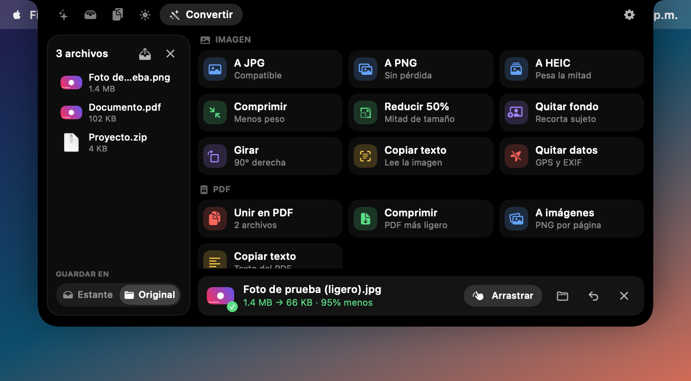
</p>

### 🎬 Teleprompter: lee tu guion mirando a la cámara

El texto pasa justo **debajo de la cámara**, así que al grabar un video, dar una clase o presentar en Zoom lees sin que se note que estás leyendo.

- **Copia tu guion y presiona ⌃⌥P**, o toca ▶︎ en una nota o en un clip.
- Cuenta regresiva 3, 2, 1 y empieza a avanzar solo.
- **Espacio** o clic en el texto pausa; **↑ ↓** cambian la velocidad; con el trackpad lo mueves a mano; **esc** lo cierra.
- Cambia el tamaño de letra y la velocidad desde los botones o en Ajustes → Llamadas y más.

<p align="center">
  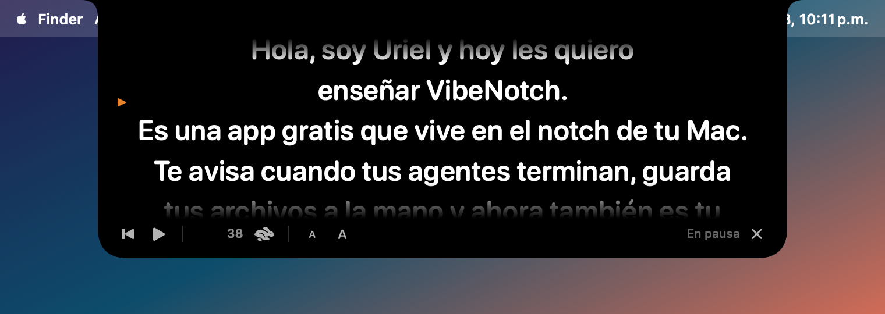
  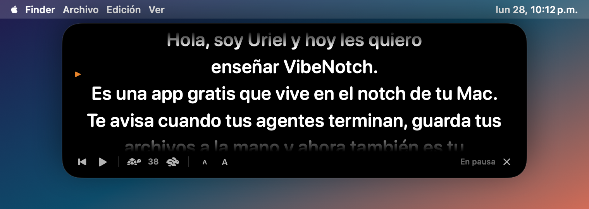
</p>

### 🎙️ Dictar en cualquier app

**Mantén presionada la tecla ⌥ derecha**, habla y suelta: el texto se escribe donde tengas el cursor (WhatsApp, Cursor, Gmail, Notion, lo que sea). Gratis y en tu Mac, como VoiceOS o Wispr Flow.

- Lo limpia solo: quita «eh», «mmm» y palabras repetidas, y pone mayúsculas. Di **«nueva línea»** para saltar de renglón.
- No pierdes lo que tenías copiado: se pega y se restaura.
- Entiende órdenes:
  - **«abre Spotify»**, «abre la calculadora», «abre ajustes»
  - **«recuérdame llamar a Ana en 10 minutos»** (pone un temporizador; sin hora, lo guarda en Notas)
  - **«busca el archivo factura»** (cuando no estás escribiendo en un campo de texto)
- Si presionas ⌥ con otra tecla (para escribir @, ñ, €…) no dicta nada.

#### ✨ Asistente tipo Jarvis (Apple Intelligence, gratis y en tu Mac)

Presiona **⌃⌥J** (o mantén ⌥ derecha y empieza con **«oye…»** / **«Jarvis…»**) y pídele cosas. En el notch ves todo lo que hace: **escuchando** (la esfera se mueve con tu voz), **pensando** y cada paso, por ejemplo «Buscando a Ana en Contactos…» o «Abriendo Cursor…». Al final aparece una tarjeta con el resultado y te contesta en voz alta.

- **Preguntas**: «¿quién es Kai Brokering?», «¿cuánto mide el Everest?» → busca en la web, lee los resultados y te resume la respuesta con las fuentes.
- **Correos y mensajes**: «mándale un correo a Ana diciendo que llego tarde» → busca a Ana en tus Contactos, redacta el correo y lo deja abierto en Mail. También funciona con WhatsApp y Mensajes. Tú le das enviar.
- **Calendario**: «¿qué tengo mañana?» te muestra tu agenda. «Pon una reunión con Luis el viernes a las 5» la guarda con un aviso 10 minutos antes.
- **Apps y web**: «abre Cursor», «abre YouTube», «busca el archivo factura», «corre mi atajo Modo foco».
- **Varias cosas en una sola orden**: «pon una reunión con Luis mañana a las 5 y abre Cursor».
- **Memoria**: «recuerda que mi jefe se llama Carlos Ibáñez», «¿qué recuerdas?», «olvida lo de Carlos». Lo que guarda lo usa después para entenderte mejor.
- **Lo que tienes seleccionado o bajo el mouse**: selecciona un texto y di «resúmelo» o «tradúcelo al inglés». Si estás escribiendo (en Mail, Notas, WhatsApp…), «corrígelo», «hazlo más formal» o «mejóralo» lo reemplaza ahí mismo (⌘Z para deshacer).
- **Platicar**: «dame ideas para un video», «explícame qué es la inflación», «escríbeme un mensaje para felicitar a mi mamá». La respuesta se va escribiendo en vivo en el notch, y al terminar sigue escuchando unos segundos para que le contestes («hazlo más corto», «¿y cuánto cuesta?»). La tarjeta tiene **Pegar**, **Documento** y **Copiar**.
- **Documentos**: «crea un documento con el plan de lanzamiento» lo escribe y lo guarda en Documentos. «Mejora el documento propuesta» o «traduce el archivo contrato al inglés» guarda una versión nueva junto al original (nunca lo sobrescribe). «Crea una nota que diga comprar pan» la guarda en Notas.
- **Organizar**: «organiza mi día» revisa tu calendario y te arma un plan con horarios y huecos libres.
- **Pestaña Jarvis (tus tareas)**: a la izquierda lo que está haciendo, lo que hizo hoy y antes, y tus habilidades; a la derecha el detalle de cada tarea con sus pasos y el resultado real (Abrir, Copiar, Repetir). Arriba puedes escribirle una orden. Si abres la pestaña mientras trabaja, sigue en segundo plano y te avisa al terminar.
- **Aprende cómo haces las cosas**: dilo una vez y ya no lo repites. «Los mensajes siempre por WhatsApp», «prefiero Spotify», «usa Gmail para los correos», «mi mamá se llama Laura Pérez», «el correo de Carlos es carlos@empresa.com». Si estás en WhatsApp, los mensajes van por WhatsApp.
- **Corrígelo y lo rehace**: justo después de algo, «no, por WhatsApp», «no, era para Laura», «mejor a las 6» (quita el evento anterior y crea el nuevo) o «mejor en Spotify». Y se queda con la corrección.
- **Contesta en el chat abierto**: en WhatsApp, Mensajes, Slack o Telegram, «respóndele que ya voy en camino» lo escribe ahí mismo.
- **Sin seleccionar nada**: «corrige esto» toma el texto del campo donde escribes y lo reemplaza; en el navegador «resume esta página» lee la página abierta.
- **Tus propias habilidades**: «cuando diga modo trabajo, abre Cursor y Slack y pon música lo-fi». Después solo di «modo trabajo». También: «crea una rutina llamada buenos días que me diga mi agenda y abra el correo», «¿qué habilidades tengo?», «borra la habilidad modo trabajo».

Con **⌃⌥J** no tienes que volver a presionar nada: deja de escuchar solo cuando haces una pausa, como Siri. Mientras escucha o trabaja, el borde del notch brilla.

**Tus palabras**: en Ajustes → Voz → «Palabras que uso» escribe apellidos, marcas o nombres raros (por ejemplo `Brokering, Ibáñez, Lynqin`) para que los escriba bien. Los nombres de tus Contactos y lo que le pides recordar se agregan solos.

Las órdenes sencillas (abrir apps, agenda, memoria) salen al instante. Las demás usan el modelo de Apple Intelligence que corre en tu Mac. Necesita macOS 26 con Apple Intelligence activado. Solo las búsquedas web salen de tu Mac, y lo que se envía (correos, mensajes) siempre queda listo para que tú lo mandes. La voz se apaga en Ajustes → Voz.
- Se apaga en Ajustes → Llamadas y más → Voz. Necesita el permiso de Accesibilidad.

### 🎙️ Notas de voz a texto

Presiona **⌃⌥D** (o el micrófono en Clips › Notas) y habla. Ves tus palabras en el notch mientras hablas; toca **Listo** (o ⌃⌥D otra vez) y se guarda como **nota** y queda **copiada** para pegarla donde quieras.

- En español, inglés y más idiomas (Ajustes → Llamadas y más → Notas de voz).
- Se procesa **en tu Mac, sin internet**, cuando macOS tiene el idioma (español de México, sí). Si no, usa el reconocimiento de Apple y te lo dice en Ajustes.
- El micrófono solo se usa mientras ves el punto rojo.

<p align="center">
  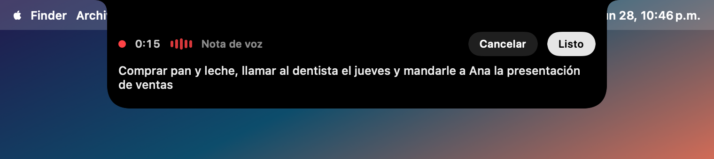
</p>

### 🔐 Códigos de verificación al instante

Cuando te llega un código por **correo, SMS** (Mensajes del iPhone), Gmail, tu banco o cualquier app, aparece en el notch **ya copiado** con el botón **Pegar**: le das clic y se escribe en el campo donde estás. Si quieres, en Ajustes activas que **se pegue solo**.

- Te dice **de dónde viene**: "Mensajes · BBVA", "Correo de Google · Gmail personal", etc., para que sepas si es el código que esperabas.
- Funciona leyendo el aviso de macOS, así que la app tiene que mostrar la vista previa en sus notificaciones.
- **Conectar tus correos** (opcional): en Ajustes → Llamadas y más → **Conectar Mail**, VibeNotch lee directamente los correos nuevos de la app Mail. Funciona con todas las cuentas que tengas ahí (Gmail, iCloud, Outlook, Yahoo…; se agregan en Ajustes del Sistema → Cuentas de Internet), encuentra el código aunque venga más abajo en el correo o tengas las vistas previas ocultas, y te dice quién lo mandó y a qué cuenta llegó. Necesita que Mail esté abierto (puede estar minimizado) y que aceptes el permiso de Automatización.
- Entiende formatos como `482913`, `482 913`, `G-482913`, `AB12CD` y no confunde horas, fechas, precios o números de pedido.
- El código **no se guarda** en el historial de Clips. Nada sale de tu Mac.
- Usa el permiso de **Accesibilidad** (Ajustes → Llamadas y más → Dar permiso).

<p align="center">
  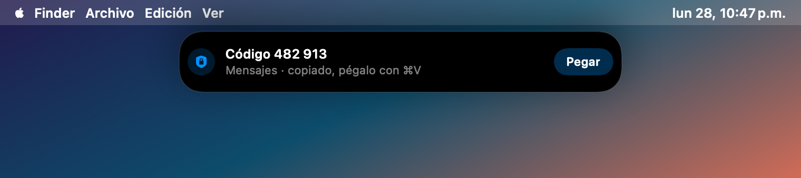
</p>

### 📞 Llamadas de WhatsApp en el notch

Cuando te llaman por WhatsApp en la Mac, el notch te muestra **quién llama** con **Contestar** y **Rechazar**. Ya en la llamada ves el tiempo en el notch cerrado y, al pasar el mouse, **Silenciar** y **Colgar**.

- Necesita la **app de WhatsApp para Mac** abierta y el permiso de **Accesibilidad** (Ajustes → Llamadas y más → Dar permiso), que es lo que deja a VibeNotch presionar los botones de WhatsApp por ti.
- WhatsApp no tiene una forma oficial para esto, así que VibeNotch lee los botones de su ventana (y el aviso de macOS). Si WhatsApp cambia su diseño puede dejar de detectarla; en ese caso contesta como siempre y [avísanos](https://github.com/uriel123-coder/vibenotch/issues).
- Las llamadas normales del iPhone y FaceTime no se pueden contestar desde otra app: macOS no lo permite.

<p align="center">
  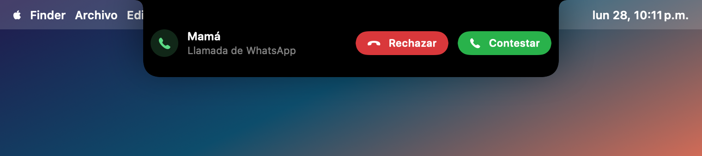
  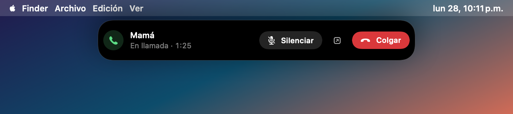
</p>

---

## Instalación (1 minuto)

**Requisitos:** macOS 14 Sonoma o más nuevo. Funciona en Apple Silicon (M1, M2, M3, M4…) e Intel, con o sin notch.

### Opción 1: un comando (recomendada)

Abre la app **Terminal** (⌘ + Espacio, escribe "Terminal", Enter), pega esto y presiona Enter:

```bash
curl -fsSL https://raw.githubusercontent.com/uriel123-coder/vibenotch/main/scripts/install.sh | bash
```

Descarga la última versión, la pone en **Aplicaciones** y la abre. Si ya la tenías, la actualiza (ve [Actualizar](#actualizar)).

### Opción 2: descargar el zip

1. Descarga **VibeNotch.zip** de [la última versión](https://github.com/uriel123-coder/vibenotch/releases/latest).
2. Descomprímelo y arrastra **VibeNotch.app** a **Aplicaciones**.
3. **La primera vez**, macOS la bloquea porque no viene de la App Store. Para abrirla:
   - Haz **clic derecho → Abrir → Abrir**, o
   - ve a **Ajustes del Sistema → Privacidad y seguridad**, baja hasta "VibeNotch se bloqueó…" y pulsa **Abrir de todos modos**.
   - Si dice que "está dañada", corre esto en Terminal y vuelve a abrirla:
     ```bash
     xattr -dr com.apple.quarantine /Applications/VibeNotch.app
     ```

> ¿Por qué pasa? VibeNotch es gratis y de código abierto, y no está firmada con un certificado de pago de Apple. Puedes revisar todo el código en este repo o compilarla tú mismo (opción 3).

### Opción 3: compilar desde el código

```bash
xcode-select --install          # solo si nunca lo instalaste (no hace falta Xcode completo)
git clone https://github.com/uriel123-coder/vibenotch.git
cd vibenotch
./build.sh install
```

---

## Actualizar

Tus ajustes, notas, clips guardados y agentes conectados **se quedan igual** al actualizar.

### Desde la app (versión 1.3 o más nueva)

VibeNotch revisa una vez al día si hay versión nueva. Cuando la hay:

- te avisa en el notch con un botón **Actualizar**, y
- aparece **Actualizar a VibeNotch 1.x** en el menú **✨** de la barra de menús.

Para revisar en ese momento, ve a **Ajustes → Acerca de → Buscar actualizaciones**.

Se descarga, se verifica y se reabre sola en unos segundos. La copia anterior se guarda en la carpeta temporal por si algo sale mal.

### Con un comando (cualquier versión)

Si tu versión es anterior a la 1.3, o el botón no aparece, abre **Terminal**, pega esto y presiona Enter. Es el mismo comando de instalar:

```bash
curl -fsSL https://raw.githubusercontent.com/uriel123-coder/vibenotch/main/scripts/install.sh | bash
```

Cierra la versión vieja, pone la nueva en **Aplicaciones** y la abre. Al final te dice qué versión quedó, por ejemplo:

```
✓ Listo: VibeNotch 1.6.0 instalada en /Applications
```

### ¿Qué versión tengo?

Mírala en **Ajustes → Acerca de**, o corre esto en Terminal:

```bash
defaults read /Applications/VibeNotch.app/Contents/Info CFBundleShortVersionString
```

La más nueva siempre está en [Releases](https://github.com/uriel123-coder/vibenotch/releases/latest).

### Después de actualizar

- macOS puede volver a pedirte algunos permisos (Accesibilidad, Mail, micrófono). Si algo deja de funcionar, ve a **Ajustes del Sistema → Privacidad y seguridad → Accesibilidad**, quita VibeNotch con "–" y vuelve a agregarla.
- Si usas Claude Code, reinicia tus sesiones para que tomen los hooks nuevos.

---

## Primeros pasos

1. Al abrirla aparece un saludo en el notch y un ✨ en la barra de menús.
2. **Para abrir VibeNotch:** lleva el mouse al notch (o arriba al centro si tu Mac no tiene) para ver un vistazo, y **haz clic** para abrirlo completo. También con ✨ en la barra de menús o **⌃⌥N**.
3. **Para ajustes:** el engrane ⚙️ dentro de VibeNotch, o clic derecho en ✨ → **Ajustes…** (⌘,).
4. Si usas Claude Code o Cursor: clic derecho en ✨ → **Conectar Claude Code** / **Conectar Cursor**. Codex y la app de Claude se detectan solos.
5. Se abre sola al iniciar sesión. Lo puedes apagar en Ajustes → General.

> **¿Tiene que estar abierta?** Sí: es una app que corre en segundo plano (no aparece en el Dock). En reposo usa unos 20 MB de RAM y prácticamente 0 % de CPU.

---

## Conectar tus agentes

Todo se hace desde el menú ✨ (clic derecho):

| Agente | Cómo se conecta | Qué ves |
| --- | --- | --- |
| **Claude Code** | Menú ✨ → **Conectar Claude Code** | Estado, preguntas, planes y permisos desde el notch, resumen al terminar, contexto, tokens |
| **App de Claude** (escritorio) | **Automático** | Sesiones de Code y Cowork: trabajando, terminado, "te necesita" y límites de uso |
| **Cursor** | Menú ✨ → **Conectar Cursor** | Estado, archivos editados, comandos, resumen al terminar |
| **Codex** (CLI y app) | **Automático**, no hay que hacer nada | Estado, comandos, tokens, resumen al terminar, límites del plan |

> **Nota sobre la app de Claude:** VibeNotch lee los archivos que la propia app guarda en tu Mac, así que ve las sesiones de **Code** y **Cowork**. Los chats normales no dejan esa información en disco, por eso no aparecen. Se puede apagar en Ajustes → Agentes.

**¿Ya lo tenías conectado de una versión anterior?** Al actualizar, VibeNotch agrega sola los hooks nuevos (preguntas y planes). Solo reinicia tus sesiones de Claude Code.

**¿Qué hace "Conectar"?** Agrega unos *hooks* a `~/.claude/settings.json` o `~/.cursor/hooks.json` que avisan a VibeNotch de lo que pasa. Respeta tu configuración: la primera vez guarda una copia (`*.vibenotch-backup`), no toca tus otros hooks y, si el archivo tiene un error, no lo modifica. Para quitarlo, vuelve a hacer clic en la misma opción.

Si VibeNotch está cerrada, los hooks no hacen nada y tus agentes siguen funcionando normal: nunca bloquea a Claude ni a Cursor.

**Límites de Claude (opcional):** con Claude Code conectado ya ves los límites cuando usas Claude. Si quieres verlos siempre, activa **"Límites de Claude desde tu cuenta (Llavero)"**. Usa la sesión de Claude Code guardada en tu Llavero para preguntarle a Anthropic tu uso. macOS te pedirá permiso la primera vez.

---

## Avisos en el celular

Deja a tu agente trabajando y vete por un café: cuando termine o te pregunte algo, te llega la notificación al celular.

1. Instala la app gratuita **[ntfy](https://docs.ntfy.sh/subscribe/phone/)** en tu iPhone o Android. No pide cuenta.
2. En VibeNotch abre **Ajustes → Celular** y activa **Avisarme en el celular**.
3. En ntfy toca **+** y escribe el código que te muestra VibeNotch (o escanea el QR).
4. Toca **Enviar prueba**.

<p align="center">
  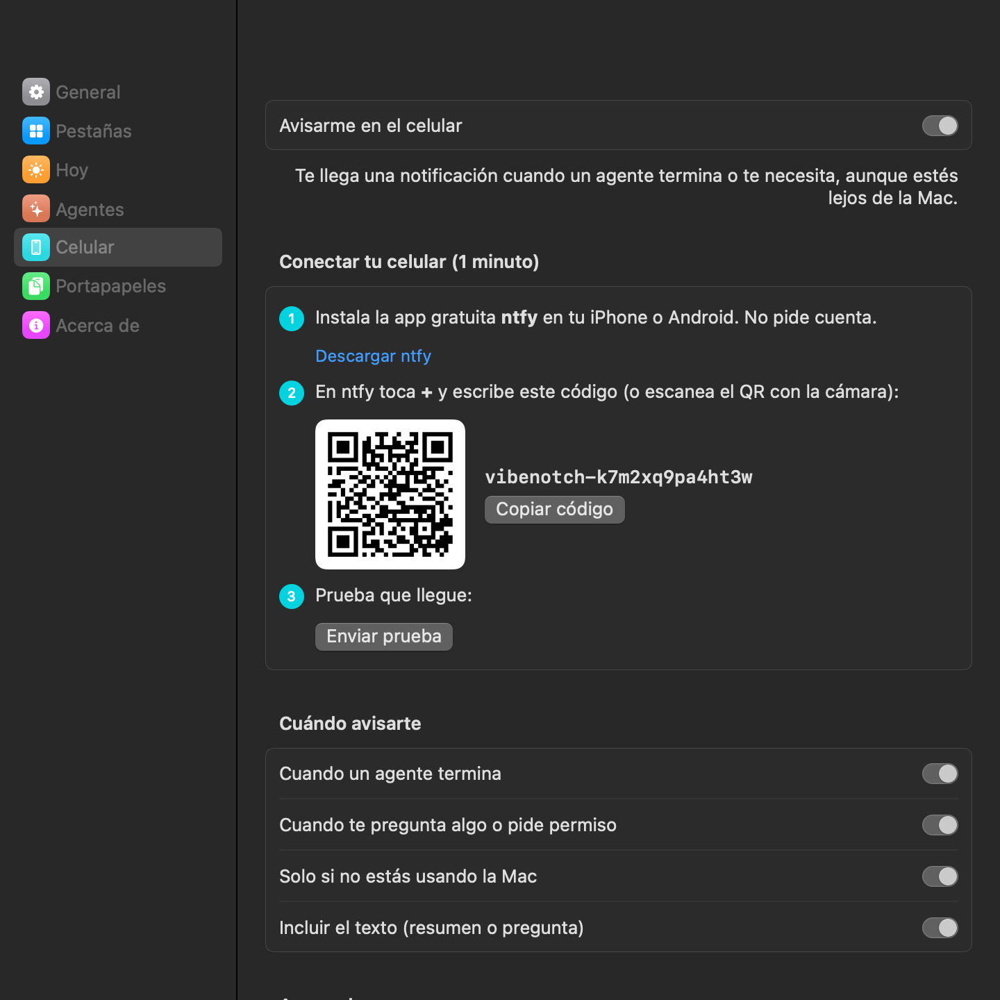
</p>

- Eliges cuándo avisarte: cuando termina, cuando te pregunta o pide permiso, o ambos.
- Por defecto **solo te avisa si no estás usando la Mac** (sin tocar teclado ni mouse durante 1 minuto y medio, o con la pantalla bloqueada). Si un agente te pregunta algo mientras estás en la Mac y te levantas sin responder, te avisa en cuanto te alejas.
- Puedes mandar solo el nombre del proyecto, sin el texto del resumen o de la pregunta.

**Privacidad:** los avisos pasan por el servidor gratuito de ntfy. Tu código es aleatorio y funciona como una contraseña: quien lo tenga podría leer tus avisos, así que no lo compartas (en Ajustes puedes crear uno nuevo). Si prefieres que nada salga de tu red, pon la dirección de tu propio servidor ntfy.

---

## Con notch o sin notch, una o varias pantallas

VibeNotch **detecta sola** si la pantalla tiene notch y usa la versión que le toca. Si conectas un monitor o cambias de pantalla, se adapta al momento.

- **Mac con notch** (MacBook Pro 14"/16" 2021+, MacBook Air M2+): VibeNotch sale del notch como si fuera parte del Mac. Las pestañas se acomodan a los lados de la cámara para que nada quede tapado.
- **Mac sin notch, iMac o monitor externo**: aparece como una **isla** flotante debajo de la barra de menús. En reposo queda una pequeña asa arriba al centro para que sepas dónde está; se muestra completa cuando un agente trabaja, suena música o corre el temporizador. Al arrastrar un archivo aparece la zona **"Suéltalo aquí"**.
- **¿Prefieres otra?** En Ajustes → General → **Estilo** eliges Automático, Notch (dibuja un notch aunque tu pantalla no tenga) o Isla flotante.
- **Varias pantallas**: por defecto aparece **en la pantalla donde está tu mouse**. Lo puedes fijar en menú ✨ → **Mostrar en** → "Pantalla principal" o una pantalla específica.
- **Pantalla completa**: se esconde cuando ves un video o una app en pantalla completa.

<p align="center">
  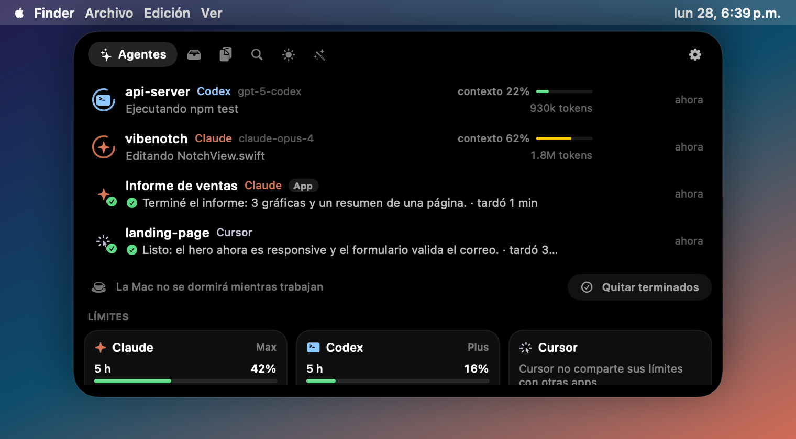
  
</p>

---

## Personalizar

Abre **Ajustes** con el engrane ⚙️ del notch o con clic derecho en ✨ → **Ajustes…**

| Sección | Qué puedes cambiar |
| --- | --- |
| General | Estilo (automático, notch o isla), en qué pantalla aparece, qué tan rápido se abre al pasar el mouse, el asa de la isla, la zona para soltar archivos, abrir al iniciar sesión, sonidos y "menos animaciones" |
| Pestañas | Qué pestañas ves y en qué orden (por ejemplo, solo Agentes y Clips) |
| Hoy | Qué widgets aparecen y en qué orden |
| Celular | Avisos en tu iPhone o Android con ntfy: cuándo avisarte, solo si no estás en la Mac, con o sin texto, servidor propio |
| Acerca de | Buscar e instalar actualizaciones con un clic |
| Agentes | Conectar o desconectar Claude Code y Cursor, seguir la app de Claude, responder preguntas desde el notch, mostrar resúmenes, cuándo quitar de la lista lo que ya terminó, no dormir la Mac (o la pantalla) mientras un agente trabaja, límites desde el Llavero |
| Portapapeles | Pausar el historial, cuántos clips guardar (50 a 500), pegar al elegir, mostrar la canción en el notch cerrado |

---

## Consumo: RAM y batería

VibeNotch está hecha para quedarse abierta todo el día sin que lo notes. Medido en una MacBook Air M1 con 8 GB:

| En reposo | |
| --- | --- |
| RAM | ~20 MB |
| CPU | ~0.1 % |
| Despertares | ~2 por segundo |

Cómo lo logra:

- Las animaciones que se repiten (el spinner de "trabajando", el pulso y el ecualizador) las anima macOS directamente, sin redibujar la app.
- Detecta la pantalla completa con avisos del sistema en vez de revisar a cada rato.
- La batería avisa al instante cuando conectas el cargador, sin sondear seguido.
- El widget de Sistema solo mide mientras está a la vista.
- Buscar arma su índice solo cuando abres la pestaña (un par de segundos) y lo refresca, como mucho, cada 10 minutos.
- La app de Claude se revisa cada 3 s solo mientras está abierta, y cada 90 s si no.
- Con **Menos animaciones** (o la opción de accesibilidad de macOS) las animaciones decorativas se detienen.

---

## Atajos de teclado

| Atajo | Acción |
| --- | --- |
| **⌃⌥N** | Abrir / cerrar VibeNotch |
| **⌃⌥V** | Abrir el portapapeles |
| **⌃⌥F** | Buscar archivos |
| **⌃⌥P** | Teleprompter con lo que copiaste (otra vez para cerrarlo) |
| **⌃⌥T** | Traducir lo que copiaste |
| **⌃⌥D** | Empezar / terminar una nota de voz |
| **Mantener ⌥ derecha** | Dictar en cualquier app: hablas, sueltas y se escribe donde está el cursor |
| **⌃⌥J** | Hablarle al asistente (otra vez para terminar de hablar) |
| **Espacio / ↑ ↓ / esc** | En el teleprompter: pausar / velocidad / cerrar |
| **↩ / ⌘↩** | En Buscar: abrir el archivo / mostrarlo en Finder |
| **⌃⌥1 … ⌃⌥9** | Copiar el texto guardado 1…9 |
| **⌘↩** | Guardar la nota que estás escribiendo |
| **⌘,** | Ajustes (con el menú ✨ abierto) |
| Clic en ✨ | Abrir / cerrar |
| Clic derecho en ✨ | Menú y ajustes |

(⌃ = Control, ⌥ = Option)

---

## Permisos

VibeNotch solo pide permisos cuando usas algo que los necesita:

| Permiso | Para qué | Cuándo lo pide |
| --- | --- | --- |
| Calendario | Mostrar tus próximos eventos y avisarte antes | Al tocar "Conectar calendario" en Hoy |
| Automatización (Spotify / Música) | Pausar y cambiar de canción | Al tocar un control de música |
| Automatización (Mail) | Leer los correos nuevos para encontrar códigos y saber quién los mandó | Si tocas "Conectar Mail" en Llamadas y más |
| Accesibilidad | Pegar automáticamente al elegir un clip, ver y contestar llamadas de WhatsApp y detectar códigos de verificación | Si activas "Pegar al elegir un clip" o tocas "Dar permiso" en Llamadas y más |
| Micrófono y Reconocimiento de voz | Notas de voz, dictado y asistente | La primera vez que dictas |
| Contactos | Que el asistente encuentre el correo o teléfono de alguien por su nombre | La primera vez que le pides escribirle a alguien |
| Calendario (asistente) | Leer tu agenda y crear eventos cuando se lo pides | La primera vez que le preguntas por tu agenda |
| Llavero | Leer los límites de tu plan de Claude | Solo si activas esa opción |
| Archivos (Escritorio, Documentos, Descargas, iCloud Drive) | Buscar archivos por nombre | La primera vez que abres Buscar |

Ver qué canción suena no necesita ningún permiso.

---

## Privacidad

- **Todo es local.** No hay cuentas, servidores, analíticas ni telemetría.
- Los agentes hablan con VibeNotch por un servidor que solo escucha en tu Mac (`127.0.0.1`) y está protegido con un token aleatorio.
- Conexiones a internet:
  - Una vez al día pregunta a GitHub si hay una versión nueva (no manda ningún dato tuyo).
  - Solo si activas **Avisos en el celular**: manda el aviso a ntfy.
  - Solo si activas los límites desde el Llavero: consulta tu uso a Anthropic con tu propia sesión.
- Las notas de voz se procesan en tu Mac cuando macOS tiene el idioma; el audio no se guarda. Los códigos de verificación solo se leen del aviso para mostrártelos y no se guardan. Si conectas Mail, VibeNotch solo revisa los correos que llegaron en los últimos minutos, en tu Mac, y no guarda ni envía su contenido.
- Traducir y corregir usan el traductor y el corrector de macOS, en tu Mac. De WhatsApp solo lee los botones y el nombre de quien llama, para mostrarlos en el notch; no lee tus chats ni guarda nada.
- De la app de Claude solo lee, en tu Mac, el estado de las sesiones y los porcentajes de uso. Nunca lee tus conversaciones ni envía nada.
- Tus datos están en `~/Library/Application Support/VibeNotch` (historial, guardados, notas, estante).
- El índice de Buscar solo guarda nombres y fechas de archivos, vive en memoria y nunca se escribe en disco ni sale de tu Mac. No lee el contenido de tus archivos.

---

## Solución de problemas

<details>
<summary><b>El notch se abre pero no puedo picar las pestañas ni el engrane / solo sale en el escritorio</b></summary>

Pasaba en versiones anteriores a la 1.3.2: el panel quedaba por debajo de la barra de menús, así que los botones de arriba (pestañas y ⚙︎) no recibían el clic, y algunas apps con ventanas del tamaño de la pantalla (como la app de Claude) se confundían con pantalla completa y escondían el notch. Antes de la 1.3.1 además el clic en el notch se iba a la barra de menús. Actualiza con este comando (cierra la versión vieja, instala la nueva y la abre):

```bash
curl -fsSL https://raw.githubusercontent.com/uriel123-coder/vibenotch/main/scripts/install.sh | bash
```

</details>

<details>
<summary><b>No veo nada en el notch / en la pantalla</b></summary>

- Revisa que haya un ✨ en la barra de menús. Si no, abre VibeNotch desde Aplicaciones.
- En Macs sin notch la isla se esconde cuando no pasa nada: pasa el mouse **arriba al centro** o presiona **⌃⌥N**.
- Con varias pantallas, aparece donde está el mouse. Cámbialo en menú ✨ → **Mostrar en**.
- Si tienes muchos íconos en la barra de menús (Bartender, Ice…), el ✨ puede estar escondido; el atajo ⌃⌥N siempre funciona.
</details>

<details>
<summary><b>"VibeNotch está dañada y no se puede abrir"</b></summary>

Es el bloqueo de Gatekeeper para apps descargadas fuera de la App Store. Corre:

```bash
xattr -dr com.apple.quarantine /Applications/VibeNotch.app && open /Applications/VibeNotch.app
```
</details>

<details>
<summary><b>Claude Code o Cursor no aparecen</b></summary>

- Menú ✨ → debe decir **"Claude Code conectado"** / **"Cursor conectado"**.
- Reinicia la sesión del agente (los hooks se leen al iniciar).
- En Claude Code, `/hooks` muestra si los hooks de VibeNotch están activos.
- Codex aparece en cuanto empieza una sesión nueva (lee `~/.codex/sessions`).
- La app de Claude aparece cuando usas Code o Cowork dentro de ella (Ajustes → Agentes → "App de Claude" encendido).
</details>

<details>
<summary><b>Las preguntas de Claude no salen en el notch</b></summary>

- Revisa Ajustes → Agentes → "Responder preguntas y aprobar planes desde el notch".
- Reinicia la sesión de Claude Code después de actualizar VibeNotch (los hooks nuevos se leen al iniciar).
- Si no respondes en unos 5 minutos, la pregunta regresa a la terminal: nunca se queda trabada.
</details>

<details>
<summary><b>"Comprimir" no achicó mi archivo</b></summary>

Si ves **"Ya estaba optimizado"**, tu archivo ya viene comprimido (por ejemplo un JPG de WhatsApp o un MP4 de redes) y hacerlo más chico lo haría verse peor. Para mandar muchos archivos juntos usa **Hacer .zip**: un zip junta archivos pero casi no reduce fotos ni videos, que ya vienen comprimidos.
</details>

<details>
<summary><b>Los atajos no funcionan</b></summary>

Otra app puede estar usando la misma combinación (⌃⌥N / ⌃⌥V). Ciérrala o cambia su atajo.
</details>

<details>
<summary><b>"Pegar al elegir un clip" no pega</b></summary>

Ve a **Ajustes del Sistema → Privacidad y seguridad → Accesibilidad** y activa VibeNotch. Si ya estaba, quítala con "–" y vuelve a agregarla (pasa después de actualizar).
</details>

---

## Desinstalar

Un comando que quita la app, **solo** los hooks de VibeNotch (el resto de tu configuración de Claude/Cursor queda igual, y guarda copia) y sus datos:

```bash
curl -fsSL https://raw.githubusercontent.com/uriel123-coder/vibenotch/main/scripts/uninstall.sh | bash
```

O a mano: menú ✨ → desconecta Claude Code y Cursor → Salir, y borra `/Applications/VibeNotch.app`, `~/.vibenotch` y `~/Library/Application Support/VibeNotch`.

---

## Compilar desde el código

Solo necesitas las **Command Line Tools** (`xcode-select --install`); no hace falta Xcode ni SwiftPM.

```bash
./build.sh            # app universal (Apple Silicon + Intel) en build/
./build.sh debug      # compilación rápida para tu Mac
./build.sh install    # compila, copia a /Applications y abre
./build.sh zip        # compila y crea build/VibeNotch.zip para compartir
```

### Estructura

```
Sources/VibeNotch/
├── App/          arranque, menú, atajos globales, modo de capturas
├── Notch/        ventana, detección de notch / isla, varias pantallas, estado
├── Agents/       Claude Code y Cursor (hooks + servidor local), Codex y app de Claude (leen sesiones)
├── Shelf/        estante de archivos
├── Search/       índice en memoria y búsqueda de archivos por nombre
├── Clipboard/    historial, guardados y notas
├── Tools/        conversión y compresión (ImageIO, Vision, PDFKit, AVFoundation)
├── Extras/       música, calendario, batería, temporizador, sistema, teleprompter, notas de voz, llamadas de WhatsApp, códigos y Mail
└── Views/        SwiftUI (notch, pestañas y ventana de ajustes)
```

### Capturas y pruebas

```bash
VIBENOTCH_SNAPSHOT=/tmp/shots ./build/VibeNotch.app/Contents/MacOS/VibeNotch                       # modo isla
VIBENOTCH_SNAPSHOT=/tmp/shots VIBENOTCH_FAKE_NOTCH=1 ./build/VibeNotch.app/Contents/MacOS/VibeNotch  # simula notch
VIBENOTCH_SNAPSHOT=/tmp/shots VIBENOTCH_SELFTEST=1 ./build/VibeNotch.app/Contents/MacOS/VibeNotch    # + prueba los conversores
VIBENOTCH_SEARCHTEST=factura ./build/VibeNotch.app/Contents/MacOS/VibeNotch                        # mide el índice y la búsqueda
VIBENOTCH_UPDATETEST=1 /tmp/copia/VibeNotch.app/Contents/MacOS/VibeNotch                           # prueba el actualizador en una copia
VIBENOTCH_TEXTTEST="nesesito la presentasion" ./build/VibeNotch.app/Contents/MacOS/VibeNotch         # prueba corregir y traducir
VIBENOTCH_CODETEST=1 ./build/VibeNotch.app/Contents/MacOS/VibeNotch                                # prueba el detector de códigos con ejemplos
VIBENOTCH_MAILTEST=1 ./build/VibeNotch.app/Contents/MacOS/VibeNotch                                # compila el lector de Mail y prueba correos de ejemplo
VIBENOTCH_TABTEST=1 ./build/VibeNotch.app/Contents/MacOS/VibeNotch                                 # abre el notch, recorre las pestañas y mide cuánto se traba cada cambio
VIBENOTCH_CURSORQTEST=1 ./build/VibeNotch.app/Contents/MacOS/VibeNotch                             # muestra las últimas preguntas de Cursor que detecta
VIBENOTCH_VOICETEST=1 ./build/VibeNotch.app/Contents/MacOS/VibeNotch                               # prueba la limpieza del dictado, los recordatorios y «abre…»
VIBENOTCH_AGENTTEST="abre YouTube|¿qué tengo mañana?|pon una reunión con Luis mañana a las 5 y abre Cursor" ./build/VibeNotch.app/Contents/MacOS/VibeNotch   # prueba el asistente: muestra qué haría y cuánto tarda, sin hacer nada
open -n --env VIBENOTCH_DICTATIONTEST=/tmp/voz.aiff build/VibeNotch.app                         # transcribe un audio (say -o /tmp/voz.aiff "hola")
VIBENOTCH_CALLTEST=1 ./build/VibeNotch.app/Contents/MacOS/VibeNotch                                # muestra lo que ve de WhatsApp (haz una llamada de prueba)
```

Genera todas las pantallas con datos de ejemplo, sin tocar tus datos reales ni la copia de VibeNotch que tengas abierta.

### Publicar una versión

Sube `CFBundleShortVersionString` en `Resources/Info.plist` y crea un tag: GitHub Actions compila la app universal y la publica en Releases.

```bash
git tag v1.6.0 && git push origin v1.6.0
```

¿Ideas o errores? Abre un [issue](https://github.com/uriel123-coder/vibenotch/issues). Los PRs son bienvenidos.

---

## Créditos

VibeNotch fue creada por **[Uriel Nakach](https://github.com/uriel123-coder)**. Es gratis y de código abierto bajo la [licencia MIT](LICENSE): puedes usarla, modificarla y compartirla, manteniendo el aviso de autor.

---

## English

**VibeNotch** turns your Mac's notch into a control center. On Macs without a notch it shows up as a floating island. It has six tabs:

- **Agents:** live status for Claude Code, the Claude desktop app (Code and Cowork sessions), Codex and Cursor. Answer Claude's multiple-choice questions, approve plans and allow or deny permissions right from the notch. When a task ends you see a checkmark, a summary of the reply and how long it took. You also get context/token usage and your 5-hour and weekly plan limits. Cursor sessions show up as Cursor even though Cursor runs Claude Code's hooks, finished sessions clear themselves after 10 minutes (configurable), and your Mac stays awake while any agent is working. Optional **phone notifications** through the free ntfy app (iPhone and Android, no account) tell you when an agent finishes or asks something, by default only when you are away from the Mac.
- **Shelf:** a Dropover-style shelf. Drop files on the notch and drag them out later; you can also shrink them, zip them, AirDrop them or copy their paths. Without a notch, a "Drop here" zone appears as soon as you start dragging.
- **Search (⌃⌥F):** find any file by name in milliseconds, or see your recent files. Filter by documents, PDFs, images, videos or folders; press ↩ to open, ⌘↩ to reveal in Finder, or drag the result anywhere. It builds its own in-memory index of your folders, so it works even with Spotlight turned off.
- **Clips:** searchable history, saved snippets on **⌃⌥1-9**, and sticky **notes** you copy with one click. Passwords are ignored.
- **Today:** widgets you pick and order: music, timer, pinned notes, battery, calendar (with a **Join** button for Zoom, Meet, Teams, Webex and FaceTime links) and a system monitor (CPU, RAM, disk).
- **Teleprompter (⌃⌥P):** your script scrolls right under the camera so you read while looking at the lens. Space pauses, ↑/↓ change speed.
- **WhatsApp calls:** see who's calling and answer, decline, mute or hang up from the notch (needs the WhatsApp Mac app and Accessibility permission).
- **Dictate anywhere (hold right ⌥):** speak and let go; cleaned-up text is typed where your cursor is, and "abre…", "busca…", "recuérdame…" run as commands. Free and on-device.
- **Voice notes (⌃⌥D):** talk and watch the words appear in the notch; they're saved as a note and copied. On-device when macOS has the language.
- **Verification codes:** when a 2FA code arrives by email, SMS (Messages), Gmail or your bank, it pops up in the notch already copied, with a **Paste** button (or pastes itself if you want), and tells you who sent it. Optionally connect Apple Mail to read new emails from all your accounts directly (Gmail, iCloud, Outlook…). Not saved in the clipboard history.
- **Translate and fix spelling** of any clip with one click, or **⌃⌥T** for what you just copied, using macOS's on-device translator and spell checker.
- **Convert:** 23 local tools. Image formats, real compression (it tries several encodings and keeps the smallest good one, or tells you the file was already optimized), background removal, OCR, merging PDFs, video to MP4/GIF, audio extraction, zip/unzip.

It detects whether your screen has a notch and switches between notch and island automatically (you can force either in Settings). Idle it uses about 20 MB of RAM and ~0.1% CPU.

**Install or update** (macOS 14+, Apple Silicon or Intel). The same command updates an existing install and keeps your settings and notes:

```bash
curl -fsSL https://raw.githubusercontent.com/uriel123-coder/vibenotch/main/scripts/install.sh | bash
```

From 1.3 on, the app checks for updates once a day and updates itself with one click (Settings → About → Check for updates). Or download the zip from [Releases](https://github.com/uriel123-coder/vibenotch/releases/latest). The app is ad-hoc signed, so the first time right-click → Open, or run `xattr -dr com.apple.quarantine /Applications/VibeNotch.app`.

Open it with **⌃⌥N**, by hovering the top center of the screen, or by clicking ✨ in the menu bar. The gear inside the notch opens Settings (tabs, widgets, style, hover speed…). Right-click ✨ to connect Claude Code or Cursor. Codex and the Claude app are picked up automatically. Everything runs locally, with no accounts and no telemetry.

Created by **[Uriel Nakach](https://github.com/uriel123-coder)**. MIT © 2026 Uriel Nakach.
