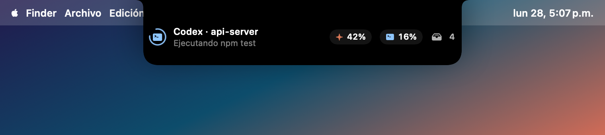
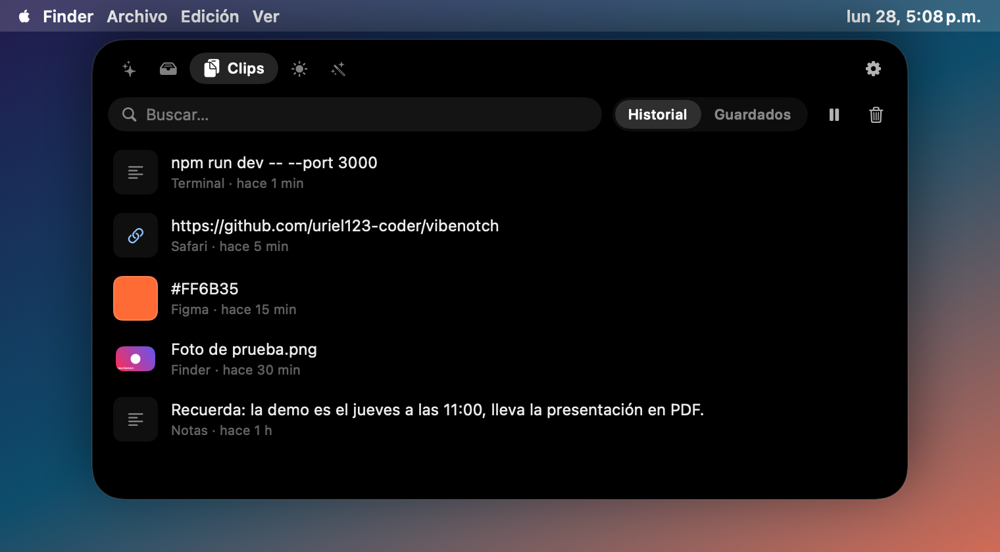
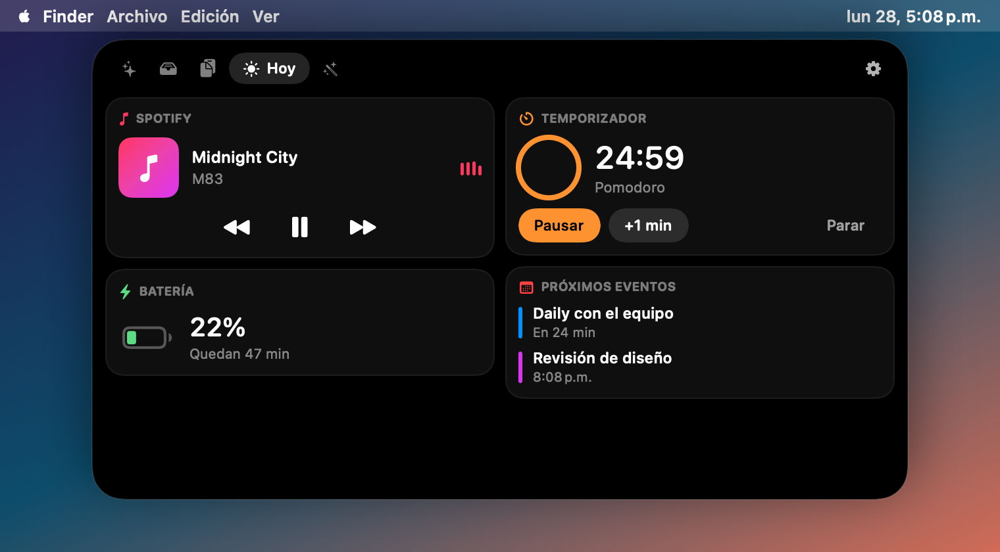

<div align="center">


# VibeNotch

**El notch de tu Mac, convertido en centro de control para tus agentes de IA, tus archivos y tu día.**

Claude Code · Codex · Cursor · estante tipo Dropover · portapapeles · convertidor de archivos · música, timer y calendario

[](https://github.com/uriel123-coder/vibenotch/actions/workflows/build.yml)
[](https://github.com/uriel123-coder/vibenotch/releases/latest)


[](LICENSE)


</div>

---

## Índice

- [¿Qué hace?](#qué-hace)
- [Instalación (1 minuto)](#instalación-1-minuto)
- [Primeros pasos](#primeros-pasos)
- [Conectar tus agentes](#conectar-tus-agentes)
- [Con notch o sin notch, una o varias pantallas](#con-notch-o-sin-notch-una-o-varias-pantallas)
- [Atajos de teclado](#atajos-de-teclado)
- [Permisos](#permisos)
- [Privacidad](#privacidad)
- [Solución de problemas](#solución-de-problemas)
- [Desinstalar](#desinstalar)
- [Compilar desde el código](#compilar-desde-el-código)
- [English](#english)

---

## ¿Qué hace?

VibeNotch vive en el notch (o en una "isla" flotante si tu Mac no tiene notch). Pasa el mouse arriba al centro y se abre. Tiene 5 pestañas:

### ✨ Agentes: ve lo que hace tu IA sin cambiar de ventana

- **Claude Code, Codex y Cursor** en un solo lugar: qué proyecto, qué está haciendo ("Editando NotchView.swift", "Ejecutando npm test") y si ya terminó.
- **Permisos desde el notch**: cuando Claude Code pide permiso para correr un comando, aparece la tarjeta y respondes **Permitir** o **Rechazar** sin ir a la terminal.
- **Aviso al terminar** con sonido, para que no tengas que vigilar la terminal.
- **Contexto y tokens** de cada sesión (barra de contexto usado y tokens totales).
- **Límites de tu plan**: ventana de 5 horas y semanal de Claude (Pro/Max) y de Codex (Plus/Pro), con cuándo se reinician.

<p align="center">
  
  
</p>

### 📥 Estante: arrastra y suelta, como Dropover

Arrastra cualquier archivo hacia el notch y se queda ahí guardado. Después lo arrastras a donde quieras (Mail, Slack, Finder, un prompt…). Desde el estante también puedes hacer zip, mandarlo por AirDrop, copiar rutas o abrirlo en Convertir.

### 📋 Portapapeles: historial y snippets guardados

- Historial de lo último que copiaste (texto, links, colores, imágenes y archivos), con buscador.
- **Guarda snippets** que usas siempre y cópialos con **⌃⌥1…9**.
- Ignora automáticamente contraseñas de 1Password y apps que marcan el contenido como privado.
- Opcional: pegar directamente al elegir un clip.

<p align="center">
  
  
</p>

### ☀️ Hoy

Controles de **Spotify / Apple Music**, **temporizador** (Pomodoro), **batería** con tiempo restante y **próximos eventos** de tu calendario, con aviso 5 minutos antes.

### 🪄 Convertir: 22 herramientas para archivos

Suelta archivos y elige qué hacer. Todo se hace en tu Mac, sin subir nada a internet.

| Tipo | Herramientas |
| --- | --- |
| Imagen | A JPG · A PNG · A HEIC · Comprimir · Reducir 50% · **Quitar fondo** · Girar · **Copiar texto (OCR)** · Quitar datos GPS/EXIF |
| PDF | Unir PDFs e imágenes en un PDF · Comprimir PDF · PDF a imágenes · Copiar texto |
| Video y audio | Comprimir video (MP4 720p) · A MP4 · **A GIF** · Sacar audio · A M4A |
| Archivos | Zip · Descomprimir · Copiar rutas · AirDrop |

Te dice cuánto ahorraste ("1.4 MB → 52 KB · 96% menos") y eliges si el resultado se guarda en el estante o junto al original.

<p align="center">
  
  
</p>

---

## Instalación (1 minuto)

**Requisitos:** macOS 14 Sonoma o más nuevo. Funciona en Apple Silicon (M1, M2, M3, M4…) e Intel, con o sin notch.

### Opción 1: un comando (recomendada)

Abre la app **Terminal** (⌘ + Espacio, escribe "Terminal", Enter), pega esto y presiona Enter:

```bash
curl -fsSL https://raw.githubusercontent.com/uriel123-coder/vibenotch/main/scripts/install.sh | bash
```

Descarga la última versión, la pone en **Aplicaciones** y la abre. Si ya la tenías, la actualiza. Es el mismo comando para actualizar.

### Opción 2: descargar el zip

1. Descarga **VibeNotch.zip** de [la última versión](https://github.com/uriel123-coder/vibenotch/releases/latest).
2. Descomprímelo y arrastra **VibeNotch.app** a **Aplicaciones**.
3. **La primera vez**, macOS la bloquea porque no viene de la App Store. Para abrirla:
   - Haz **clic derecho → Abrir → Abrir**, o
   - ve a **Ajustes del Sistema → Privacidad y seguridad**, baja hasta "VibeNotch se bloqueó…" y pulsa **Abrir de todos modos**.
   - Si dice que "está dañada", corre esto en Terminal y vuelve a abrirla:
     ```bash
     xattr -dr com.apple.quarantine /Applications/VibeNotch.app
     ```

> ¿Por qué pasa? VibeNotch es gratis y de código abierto, y no está firmada con un certificado de pago de Apple. Puedes revisar todo el código en este repo o compilarla tú mismo (opción 3).

### Opción 3: compilar desde el código

```bash
xcode-select --install          # solo si nunca lo instalaste (no hace falta Xcode completo)
git clone https://github.com/uriel123-coder/vibenotch.git
cd vibenotch
./build.sh install
```

---

## Primeros pasos

1. Al abrirla aparece un saludo en el notch y un ✨ en la barra de menús.
2. **Para abrir VibeNotch:** pasa el mouse arriba al centro de la pantalla, haz clic en ✨ o presiona **⌃⌥N**.
3. **Para ajustes:** clic derecho en ✨ (o el engrane dentro de VibeNotch).
4. Se abre sola al iniciar sesión. Lo puedes apagar en el menú ✨ → "Abrir al iniciar sesión".

> **¿Tiene que estar abierta?** Sí: es una app que corre en segundo plano (no aparece en el Dock). Usa muy poca memoria y CPU.

---

## Conectar tus agentes

Todo se hace desde el menú ✨ (clic derecho):

| Agente | Cómo se conecta | Qué ves |
| --- | --- | --- |
| **Claude Code** | Menú ✨ → **Conectar Claude Code** | Estado, permisos desde el notch, aviso al terminar, contexto, tokens |
| **Cursor** | Menú ✨ → **Conectar Cursor** | Estado, archivos editados, comandos, aviso al terminar |
| **Codex** (CLI y app) | **Automático**, no hay que hacer nada | Estado, comandos, tokens, límites del plan |

**¿Qué hace "Conectar"?** Agrega unos *hooks* a `~/.claude/settings.json` o `~/.cursor/hooks.json` que avisan a VibeNotch de lo que pasa. Respeta tu configuración: la primera vez guarda una copia (`*.vibenotch-backup`), no toca tus otros hooks y, si el archivo tiene un error, no lo modifica. Para quitarlo, vuelve a hacer clic en la misma opción.

Si VibeNotch está cerrada, los hooks no hacen nada y tus agentes siguen funcionando normal: nunca bloquea a Claude ni a Cursor.

**Límites de Claude (opcional):** con Claude Code conectado ya ves los límites cuando usas Claude. Si quieres verlos siempre, activa **"Límites de Claude desde tu cuenta (Llavero)"**. Usa la sesión de Claude Code guardada en tu Llavero para preguntarle a Anthropic tu uso. macOS te pedirá permiso la primera vez.

---

## Con notch o sin notch, una o varias pantallas

- **Mac con notch** (MacBook Pro 14"/16" 2021+, MacBook Air M2+): VibeNotch sale del notch como si fuera parte del Mac. Las pestañas se acomodan a los lados de la cámara para que nada quede tapado.
- **Mac sin notch, iMac o monitor externo**: aparece como una **isla** flotante debajo de la barra de menús. En reposo se esconde; se muestra sola cuando un agente está trabajando, suena música o corre el temporizador.
- **Varias pantallas**: por defecto aparece **en la pantalla donde está tu mouse**. Lo puedes fijar en menú ✨ → **Mostrar en** → "Pantalla principal" o una pantalla específica.
- **Pantalla completa**: se esconde cuando ves un video o una app en pantalla completa.

<p align="center">
  
  
</p>

---

## Atajos de teclado

| Atajo | Acción |
| --- | --- |
| **⌃⌥N** | Abrir / cerrar VibeNotch |
| **⌃⌥V** | Abrir el portapapeles |
| **⌃⌥1 … ⌃⌥9** | Copiar el snippet guardado 1…9 |
| Clic en ✨ | Abrir / cerrar |
| Clic derecho en ✨ | Ajustes |

(⌃ = Control, ⌥ = Option)

---

## Permisos

VibeNotch solo pide permisos cuando usas algo que los necesita:

| Permiso | Para qué | Cuándo lo pide |
| --- | --- | --- |
| Calendario | Mostrar tus próximos eventos y avisarte antes | Al tocar "Conectar calendario" en Hoy |
| Automatización (Spotify / Música) | Pausar y cambiar de canción | Al tocar un control de música |
| Accesibilidad | Pegar automáticamente al elegir un clip | Solo si activas "Pegar al elegir un clip" |
| Llavero | Leer los límites de tu plan de Claude | Solo si activas esa opción |

Ver qué canción suena no necesita ningún permiso.

---

## Privacidad

- **Todo es local.** No hay cuentas, servidores, analíticas ni telemetría.
- Los agentes hablan con VibeNotch por un servidor que solo escucha en tu Mac (`127.0.0.1`) y está protegido con un token aleatorio.
- La única conexión a internet es opcional: la consulta de límites de Claude a Anthropic, con tu propia sesión, si activas esa opción.
- Tus datos están en `~/Library/Application Support/VibeNotch` (historial, snippets, estante).

---

## Solución de problemas

<details>
<summary><b>No veo nada en el notch / en la pantalla</b></summary>

- Revisa que haya un ✨ en la barra de menús. Si no, abre VibeNotch desde Aplicaciones.
- En Macs sin notch la isla se esconde cuando no pasa nada: pasa el mouse **arriba al centro** o presiona **⌃⌥N**.
- Con varias pantallas, aparece donde está el mouse. Cámbialo en menú ✨ → **Mostrar en**.
- Si tienes muchos íconos en la barra de menús (Bartender, Ice…), el ✨ puede estar escondido; el atajo ⌃⌥N siempre funciona.
</details>

<details>
<summary><b>"VibeNotch está dañada y no se puede abrir"</b></summary>

Es el bloqueo de Gatekeeper para apps descargadas fuera de la App Store. Corre:

```bash
xattr -dr com.apple.quarantine /Applications/VibeNotch.app && open /Applications/VibeNotch.app
```
</details>

<details>
<summary><b>Claude Code o Cursor no aparecen</b></summary>

- Menú ✨ → debe decir **"Claude Code conectado"** / **"Cursor conectado"**.
- Reinicia la sesión del agente (los hooks se leen al iniciar).
- En Claude Code, `/hooks` muestra si los hooks de VibeNotch están activos.
- Codex aparece en cuanto empieza una sesión nueva (lee `~/.codex/sessions`).
</details>

<details>
<summary><b>Los atajos no funcionan</b></summary>

Otra app puede estar usando la misma combinación (⌃⌥N / ⌃⌥V). Ciérrala o cambia su atajo.
</details>

<details>
<summary><b>"Pegar al elegir un clip" no pega</b></summary>

Ve a **Ajustes del Sistema → Privacidad y seguridad → Accesibilidad** y activa VibeNotch. Si ya estaba, quítala con "–" y vuelve a agregarla (pasa después de actualizar).
</details>

---

## Desinstalar

Un comando que quita la app, **solo** los hooks de VibeNotch (el resto de tu configuración de Claude/Cursor queda igual, y guarda copia) y sus datos:

```bash
curl -fsSL https://raw.githubusercontent.com/uriel123-coder/vibenotch/main/scripts/uninstall.sh | bash
```

O a mano: menú ✨ → desconecta Claude Code y Cursor → Salir, y borra `/Applications/VibeNotch.app`, `~/.vibenotch` y `~/Library/Application Support/VibeNotch`.

---

## Compilar desde el código

Solo necesitas las **Command Line Tools** (`xcode-select --install`); no hace falta Xcode ni SwiftPM.

```bash
./build.sh            # app universal (Apple Silicon + Intel) en build/
./build.sh debug      # compilación rápida para tu Mac
./build.sh install    # compila, copia a /Applications y abre
./build.sh zip        # compila y crea build/VibeNotch.zip para compartir
```

### Estructura

```
Sources/VibeNotch/
├── App/          arranque, menú, atajos globales, modo de capturas
├── Notch/        ventana, detección de notch / isla, varias pantallas, estado
├── Agents/       Claude Code y Cursor (hooks + servidor local), Codex (lee sesiones)
├── Shelf/        estante de archivos
├── Clipboard/    historial y snippets
├── Tools/        motor de conversión (ImageIO, Vision, PDFKit, AVFoundation)
├── Extras/       música, calendario, batería, temporizador
└── Views/        SwiftUI
```

### Capturas y pruebas

```bash
VIBENOTCH_SNAPSHOT=/tmp/shots ./build/VibeNotch.app/Contents/MacOS/VibeNotch                       # modo isla
VIBENOTCH_SNAPSHOT=/tmp/shots VIBENOTCH_FAKE_NOTCH=1 ./build/VibeNotch.app/Contents/MacOS/VibeNotch  # simula notch
VIBENOTCH_SNAPSHOT=/tmp/shots VIBENOTCH_SELFTEST=1 ./build/VibeNotch.app/Contents/MacOS/VibeNotch    # + prueba los conversores
```

Genera todas las pantallas con datos de ejemplo, sin tocar tus datos reales ni la copia de VibeNotch que tengas abierta.

### Publicar una versión

Sube `CFBundleShortVersionString` en `Resources/Info.plist` y crea un tag: GitHub Actions compila la app universal y la publica en Releases.

```bash
git tag v1.0.1 && git push origin v1.0.1
```

¿Ideas o errores? Abre un [issue](https://github.com/uriel123-coder/vibenotch/issues). Los PRs son bienvenidos.

---

## English

**VibeNotch** turns your Mac's notch into a control center. On Macs without a notch it shows up as a floating island. It has five tabs:

- **Agents:** live status for Claude Code, Codex and Cursor. Approve or deny Claude permission requests right from the notch. You also get done alerts, context/token usage and your 5-hour and weekly plan limits.
- **Shelf:** a Dropover-style shelf. Drop files on the notch and drag them out later; you can also zip them, AirDrop them or copy their paths.
- **Clipboard:** searchable history plus saved snippets on **⌃⌥1-9**. Passwords are ignored.
- **Today:** Spotify/Music controls, a timer, battery and upcoming calendar events.
- **Convert:** 22 local tools. Image formats, compression, background removal, OCR, merging and shrinking PDFs, video to MP4/GIF, audio extraction, zip/unzip.

**Install** (macOS 14+, Apple Silicon or Intel):

```bash
curl -fsSL https://raw.githubusercontent.com/uriel123-coder/vibenotch/main/scripts/install.sh | bash
```

Or download the zip from [Releases](https://github.com/uriel123-coder/vibenotch/releases/latest). The app is ad-hoc signed, so the first time right-click → Open, or run `xattr -dr com.apple.quarantine /Applications/VibeNotch.app`.

Open it with **⌃⌥N**, by hovering the top center of the screen, or by clicking ✨ in the menu bar. Right-click ✨ for settings and to connect Claude Code or Cursor. Codex is picked up automatically. Everything runs locally, with no accounts and no telemetry.

MIT © 2026 Uriel Nakach
